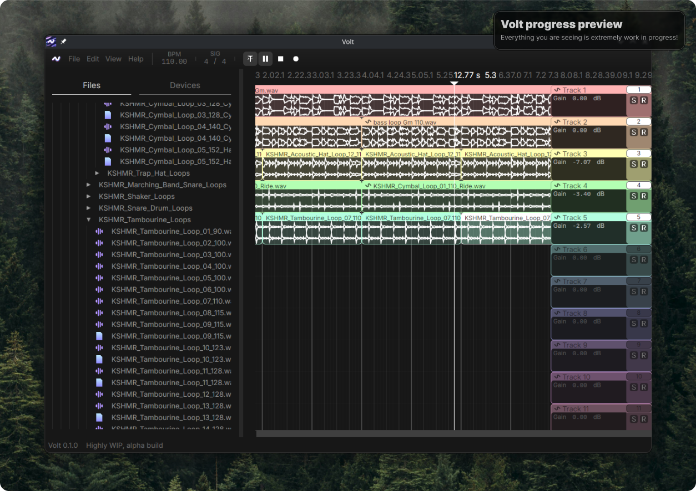

# Volt DAW

Volt is a custom DAW (digital audio workstation) that is primarily aimed at Linux (with Windows and macOS support too) and is fully open-source. Built with gpui and cpal.

Feel free to make improvements and additions to the DAW, and submit a PR!
Additionally, you can also open issues with the DAW.

## Our community
You can join our official Volt Community Discord server at https://discord.gg/PDYpvar9Vu!
Feel free to discuss anything related to Volt there, as well as music production.

## Current state

The DAW at the moment is highly unfinished and is currently primarily in the testing phase.
If anyone can volunteer to improve the DAW, please do! PRs are super welcome.

Here's a screenshot:

## Our Roadmap:

We have a list of things we want to achieve, and here it is for easy editing and viewing:
- [ ] Project file format
    - [ ] Define a spec
    - [ ] Implementation
        - [ ] Store arrangements (and the playlist)
        - [ ] Store timing information (time signature and BPM, etc)
        - [ ] Store MIDI
        - [ ] DAW file autosearching if audio file not found
        - [ ] Store references to audio (DO NOT STORE THE ENTIRE AUDIO)
        - [ ] Store mixer information, applied effects
- [ ] Browser functionality
    - [x] Being able to browse files on the system
    - [x] Being able to import audio files
    - [x] Playback of audio
    - [ ] Being able to import devices (that is, plugins, effects, VSTs or similar)
- [ ] Playlist functionality
    - [x] Scrolling, scaling and similar UI functionality
    - [x] Time signatures, BPM and related
    - [x] Playback of audio
    - [x] Fast waveform rendering
    - [ ] Time stretching
    - [ ] Clip configuration and editing
    - [ ] Track configuration
        - [ ] Routing
        - [ ] Effects
    - [ ] Shortcuts
    - [ ] Arrangements
    - [ ] Importing other arrangements into an existing arrangement
- [ ] Piano Roll/MIDI Editor
- [ ] UI & UX
    - [x] Theming system
        - This is WIP
    - [ ] Settings UI
    - [ ] About UI
    - [ ] Primary workflow elements (such as editing modes/tools, like a pencil/brush for drawing in clips, or a selection tool for selecting elements)
    - [ ] Command Palette for easy search and execution of tasks
    - [ ] System for dialog boxes (with an option to make them movable)
    - [ ] Intuitive audio track and midi track design
    - [ ] Shortcuts configuration
    - [ ] Welcome screen
    - [ ] Tutorials/lessons system for newcomers
- [ ] Audio Processing
    - [ ] Plugin Support
        - [ ] Built-in plugins
        - [ ] LV2 support
        - [ ] VST3 support
        - [ ] CLAP support
        - [ ] VST2 support
    - [x] Audio playback
    - [ ] Audio formats (support can be provided either through custom implementations or libraries)
        - [x] .wav support
        - [ ] .ogg support
        - [x] .mp3 support
        - [ ] .m4a support
        - [ ] .opus support
        - [x] .flac support
        - [ ] .alac support
        - [ ] .aac support
        - [ ] .wma support
        - [ ] .aiff support
    - [ ] Effects pipeline
        - **Note:** this is work-in-progress!
    - [ ] Fast live audio processing (this means being able to take in an unpredictable input and processing it, like microphone input)
    - [ ] Support for ALSA, JACK, PulseAudio and PipeWire if possible
    - [x] Mixing pipeline
        - This is WIP
    - [ ] ASIO support (this is an issue primarily on Windows)
    - [ ] Audio stretching and squeezing with little to no noticable artifacts, while preserving or modifying formants
    - [ ] Potentially related to machine learning:
        - [ ] Converting audio to MIDI using Machine Learning tools
        - [ ] Audio declipping using Machine Learning tools
        - [ ] Audio BPM detection

The roadmap is still very work-in-progress, we're structuring it as we go, not everything may be mentioned.

There are a number of important design decisions and routes we want to take for our DAW. Here are our core principles:
- Uncluttered design. This means that we should stick to one primary way of achieving a task, rather than having many ways to do the same thing. This point is where a lot of open-source DAWs (and other software) fail.
- Clear language. This means that our design language should follow industry standard and use easily understandable icons or text to imply actions.
- Don't be an "everything" software. We don't want to have every feature under the sun. We want to have a reasonable amount of features that we think DAWs should have, and keep improving on them.
- Quality over quantity. We want to make our existing features as close to good enough or perfect as possible, not have a ridiculous amount of features most of which you'll never use. This means we prioritize improving core features over tiny features which barely affect workflow.
- Stay out of the way. We don't want to be like what happens to VSCode when a few extensions lead you to notification hell and clutter the whole notifcations menu with messages you do not care about. The design should be clean and the software should stay out of your way.
- Speed. We want for our DAW to function efficiently and we aim to prioritize performance over overly flashy looks.
- Reliability. The DAW shouldn't crash and shouldn't freeze whatsoever (there's a reason we chose Rust over languages like C++).
- Never freeze. It's better to show the user the DAW is actually doing something (i.e. show a loading icon) rather than freezing the whole DAW. This means putting things off to other threads, and reserving the main thread for UI. We are in the multi-threaded era, and we can make use of this. This way, the DAW can not only *be* fast, but *feel* fast.
- Power-efficiency. The DAW should consume minimal power while idle, as being able to make music on the go is important for many music producers.
- Compatibility. Volt aims to function on Windows, macOS and Linux without major restrictions or downsides.
- Support. Volt aims to maximize support for things like MIDI controllers, audio hardware or similar. This is not as high of a priority as all the other points, however, it is still important to us, as is to a lot of music producers.
